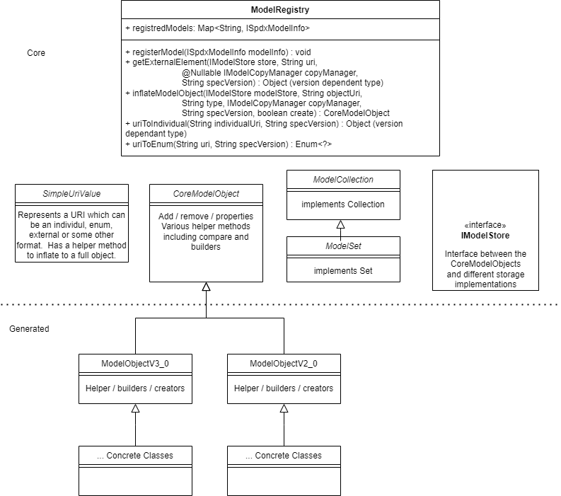

# spdx-java-core

This repository is a component of the Java library which implements the Java object model for the [System Package Data Exchange (SPDX)](https://spdx.dev/) and provides useful helper functions.

This repository contains core files used as a base and common to all model files.

The API documentation is available at:
<https://spdx.github.io/spdx-java-core/>

Please refer to the [Spdx-Java-Library](https://github.com/spdx/spdx-java-Library) for information on how to use the code in this repository.

Contributions are welcome.  See [CONTRIBUTING.md](CONTRIBUTING.md).

## Code quality badges

   

## Overall Architecture

The primary class in the core library is the [CoreModelObject](https://spdx.github.io/spdx-java-core/org/spdx/core/CoreModelObject.html).  All SPDX model classes inherit this class.  It contains several useful functions including the ability to compare to other CoreModelObjects, add/remove properties, and manage collections.

Each major version of [the SPDX specification](https://spdx.org/specifications) should generate its own set of classes which inherit from the CoreModelObject.

Below is a simplified class model diagram which includes example SPDX model versions:

## Development Status

Very much under development and not very stable.
